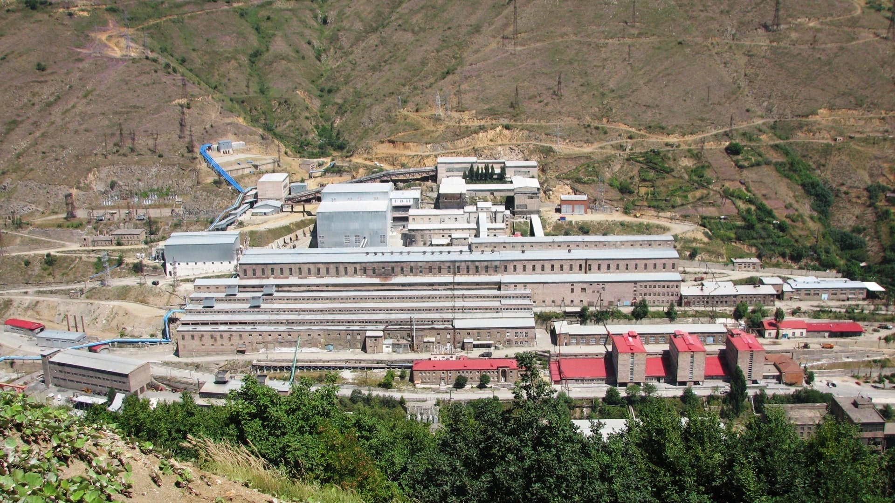
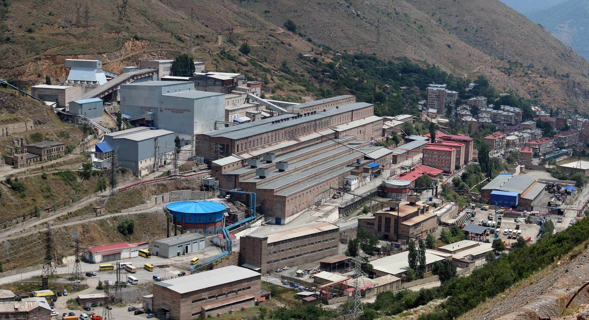
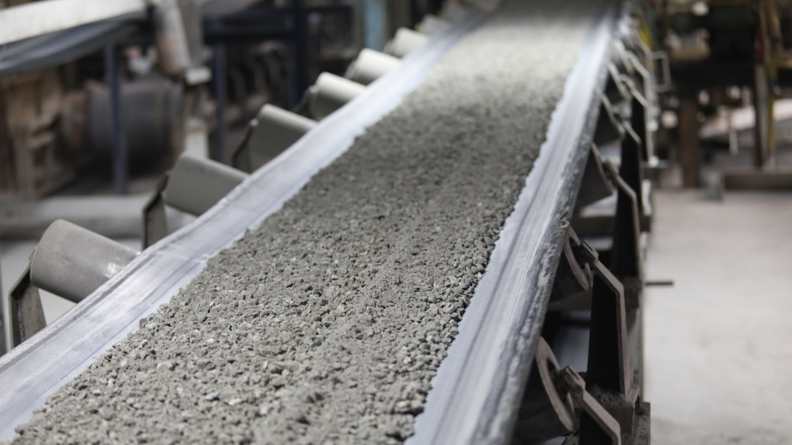
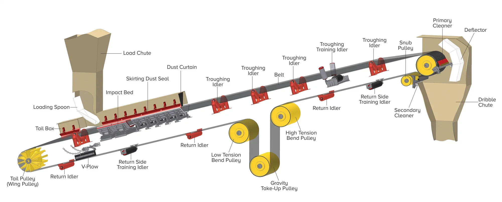

# Քաջարանի պղնձամոլիբդենային կոմբինատի գլխավոր փոխակրիչի թվային երկվորյակի ծրագրավորում՝ գրաֆային նեյրոնային ցանցերի հիման վրա

## Ներածություն
Այս աշխատանքը ներկայացնում է Քաջարանի պղնձամոլիբդենային կոմբինատի գլխավոր փոխակրիչ համակարգի համար թվային երկվորյակի մշակման մեթոդաբանություն՝ կանխատեսող սպասարկման վրա կենտրոնանալով։ Առաջարկվող համակարգը երկբաղադրիչ է։ Առաջին բաղադրիչը Գրաֆային Նեյրոնային Ցանցի (GNN) վրա հիմնված մոդելն է, որը փոխակրիչների ցանցը ներկայացնում է որպես գրաֆ՝ սարքավորումների խափանումների, մասնավորապես՝ գերտաքացման ռիսկերը ճշգրիտ կանխատեսելու համար։ Երկրորդ բաղադրիչը որոնմամբ ընդլայնված գեներացիայի (RAG) վրա հիմնված ախտորոշիչ գործակալն է, որին փոխանցվում են GNN մոդելի կանխատեսումները։ Օգտագործելով տեխնիկական փաստաթղթերի գիտելիքների բազան՝ RAG գործակալը մեկնաբանում է ռիսկերը, տրամադրում է հիմնավորված բացատրություններ և առաջարկում գործողություններ օպերատորների համար։ Սույն աշխատանքը մանրամասնում է առաջարկվող համակարգի նկարագրությունը, գրաֆային մոդելավորումը, GNN ճարտարապետությունը և RAG գործակալի կառուցվածքը։

Քաջարանի պղնձամոլիբդենային կոմբինատը Հայաստանի հանքարդյունաբերության հիմնասյուներից է։ Նրա գործունեության կենտրոնում գտնվում է հսկայական և բարդ գլխավոր փոխակրիչ համակարգը, որը պատասխանատու է հում հանքաքարի տեղափոխման համար՝ ջարդման և վերամշակման տարբեր փուլերով։ Փոխակրիչների, ջարդիչների և սնուցիչների այս ցանցը գործում է որպես ամբողջ արտադրության զարկերակային համակարգ։ Համակարգի տեխնիկական նկարագրությունը, ներկայացված «Карточка цеха дробления и транспортировки руды» տվյալներում, վկայում է արտադրական գործընթացի լայնածավալ և շարունակական բնույթի մասին։ Հաշվի առնելով համակարգի մասշտաբը և այն, որ բաղադրիչները կազմում են մեկ ընդհանուր շղթա, ընդհանուր հուսալիությունը ձեռք է բերում առաջնային նշանակություն, քանի որ մեկ բաղադրիչի անսպասելի խափանումը կամ կանգառը կարող է շղթայական ռեակցիա առաջացնել արտադրական գծում՝ հանգեցնելով զգալի պարապուրդի, արտադրողականության անկման և անվտանգության ռիսկերի։


*Նկար 1: Քաջարանի պղնձամոլիբդենային կոմբինատի ընդհանուր տեսքը։*

Ներկայումս նման արդյունաբերական համակարգերի սպասարկումը հիմնականում իրականացվում է պլանային (կանխարգելիչ) կամ խափանման դեպքում (ռեակտիվ) ռազմավարություններով։ Թեև պլանային սպասարկումը կարող է կանխել որոշ խափանումներ, այն հաճախ տնտեսապես անարդյունավետ է, քանի որ հանգեցնում է այնպիսի բաղադրիչների փոխարինման, որոնք դեռևս ունեն զգալի օգտակար կյանք։ Ի հակադրություն, ռեակտիվ սպասարկումը կապված է չնախատեսված պարապուրդի պատճառով առաջացած մեծ ծախսերի հետ։ Հետևաբար, հիմնական մարտահրավերը կանխատեսող մոտեցման մշակումն է, որը թույլ կտա կանխատեսել բաղադրիչների խափանումները մինչև դրանց տեղի ունենալը։ Առաջնային ուշադրության կենտրոնում փոխակրիչի բաղադրիչների գերտաքացումն է, որը մեխանիկական խափանման հավանական նախանշան է և ավելորդ բեռի, շփման կամ մաշվածության հիմնական ցուցիչ։

Այս մարտահրավերին դիմակայելու համար առաջարկվում է **Թվային Երկվորյակի** մշակում՝ ֆիզիկական փոխակրիչ համակարգի բարձր ճշգրտության վիրտուալ կրկնօրինակ, որը դինամիկորեն թարմացվում է իրական ժամանակի տվյալներով։ Այս թվային երկվորյակը ծառայելու է որպես հարթակ սիմուլյացիայի, վերլուծության և կանխատեսման համար։

Այս մոտեցման հիմքում ընկած է **Գրաֆային Նեյրոնային Ցանց (GNN)** տեխնոլոգիան։ GNN-ները եզակիորեն հարմար են այս խնդրի համար, քանի որ փոխակրիչ համակարգն ինքնին ցանցային կառուցվածք ունի, որը բնականոն կերպով ներկայացվում է որպես գրաֆ։ Յուրաքանչյուր սարքավորում (փոխակրիչ, ջարդիչ) հանգույց է, իսկ դրանց միջև ֆիզիկական կապերը և նյութի հոսքը՝ կողեր։ Այս գրաֆային կառուցվածքը թույլ է տալիս մոդելին սովորել ոչ միայն առանձին բաղադրիչների բնութագրերից, այլև ավելի մեծ համակարգում դրանց փոխազդեցությունից։ Օրինակ՝ մեկ փոխակրիչի բեռնվածությունն ուղղակիորեն ազդում է հաջորդի վրա։ GNN-ները նախատեսված են հենց այսպիսի բարդ, համակարգային կախվածություններն արդյունավետորեն ֆիքսելու համար, որոնք ավանդական մեքենայական ուսուցման մոդելները հաճախ բաց են թողնում։

Համակարգի ամբողջականացման համար GNN մոդելի ելքային տվյալները կծառայեն որպես մուտքային տվյալներ **որոնմամբ ընդլայնված գեներացիայի (RAG) վրա հիմնված ինտելեկտուալ գործակալի** համար։ Այս գործակալը, օգտագործելով տեխնիկական փաստաթղթերի և սպասարկման ուղեցույցների գիտելիքների բազան, կմեկնաբանի ռիսկի գնահատականները, կբացահայտի հնարավոր պատճառները և օպերատորներին կառաջարկի կոնկրետ, համատեքստից բխող սպասարկման քայլեր՝ այդպիսով կամրջելով կանխատեսման և գործողության միջև եղած բացը։

Այս աշխատանքի հիմնական նպատակն է նախագծել և տեխնիկապես բնութագրել GNN-ի վրա հիմնված թվային երկվորյակ, որը կարող է կանխատեսող սպասարկում իրականացնել Քաջարանի կոմբինատի փոխակրիչ ցանցի համար։ Աշխատանքի կոնկրետ նպատակներն են.
1.  Համակարգի մոդելավորում որպես գրաֆ: Փոխակրիչ ցանցի տոպոլոգիայի և բաղադրիչների ներկայացումը որպես գրաֆային կառուցվածք։
2.  Իրական տվյալներից հատկանիշների մշակում: Սարքավորումների բնութագրերի և վիճակի հաշվետվությունների (`КОНВЕЙЕР.csv`-ի նման ֆայլերից) օգտագործում՝ գրաֆի յուրաքանչյուր հանգույցի համար իմաստալից թվային հատկանիշներ ստեղծելու համար։
3.  Կանխատեսման համար GNN-ի նախագծում: GNN ճարտարապետության (օրինակ՝ GCN) և ուսուցման գործընթացի սահմանում՝ կրիտիկական գործող վիճակները, մասնավորապես՝ գերտաքացման ռիսկը, յուրաքանչյուր բաղադրիչի համար կանխատեսելու համար։
4.  Անցման հիմքերի ստեղծում դեպի կանխարգելիչ սպասարկում: Համակարգի համար հիմքերի ստեղծում, որը կարող է զգուշացնել օպերատորներին մոտալուտ խափանումների մասին՝ հնարավորություն տալով իրականացնելու նպատակային, կանխարգելիչ սպասարկման միջամտություններ։

## Գրականության ակնարկ

GNN-ի վրա հիմնված թվային երկվորյակի մշակումը կանխատեսող սպասարկման համար հիմնված է մի քանի փոխկապակցված հետազոտական ոլորտների վրա։ Այս բաժնում կքննարկվեն այդ ոլորտները՝ սկսած թվային երկվորյակների ընդհանուր կիրառություններից մինչև GNN-ների օգտագործումը ֆիզիկական համակարգերի մոդելավորման համար։

Թվային երկվորյակի հայեցակարգը տեսական կառուցվածքից վերածվել է «Արդյունաբերություն 4.0»-ի (Industry 4.0) գործնական գործիքի։ «Արդյունաբերություն 4.0»-ը, կամ Չորրորդ արդյունաբերական հեղափոխությունը, իրենից ներկայացնում է արտադրական տեխնոլոգիաներում ավտոմատացման և տվյալների փոխանակման ժամանակակից միտումը։ Այն ենթադրում է «խելացի գործարանների» ստեղծում, որտեղ կիբեր-ֆիզիկական համակարգերը, Իրերի համացանցը (IoT) և արհեստական բանականությունը (AI) համատեղ աշխատում են՝ ստեղծելով փոխկապակցված և ինքնավար արդյունաբերական միջավայր։

Իր հիմքում թվային երկվորյակը ֆիզիկական օբյեկտի, գործընթացի կամ համակարգի բարձր ճշգրտության վիրտուալ ներկայացումն է։ Նրա որոշիչ բնութագիրը ֆիզիկական ակտիվի և նրա վիրտուալ գործընկերոջ միջև տվյալների շարունակական, երկկողմանի հոսքն է, որը թույլ է տալիս թվային մոդելին արտացոլել իրական աշխարհի համակարգի վիճակը գրեթե իրական ժամանակում։ Ամբողջական ճարտարապետությունը սովորաբար ներառում է երեք հիմնական բաղադրիչ՝ ֆիզիկական օբյեկտը իր աշխատանքային միջավայրում, վիրտուալ մոդելը, որը նկարագրում է ֆիզիկական օբյեկտի երկրաչափությունը, հատկությունները և վարքագիծը, և տվյալների կապը, որն ապահովում է տվյալների փոխանցումը ֆիզիկական և վիրտուալ մոդելների միջև։

Այս մոտեցման առավելությունները ընդարձակ են և փոխակերպիչ նշանակություն ունեն արդյունաբերական գործառնությունների համար։ Ստեղծելով վիրտուալ կրկնօրինակ՝ ընկերությունները կարող են իրականացնել իրական ժամանակի մոնիթորինգ, վերլուծել արտադրողականությունը տարբեր պայմաններում և կատարել «ինչ-եթե» սցենարների վերլուծություն՝ առանց ֆիզիկական սարքավորումները ռիսկի ենթարկելու։ Այս տեխնոլոգիան հաջողությամբ կիրառվում է տարբեր ոլորտներում՝ սկսած ավիատիեզերական արդյունաբերության մեջ ռեակտիվ շարժիչների մոնիթորինգից մինչև էներգետիկայի ոլորտում հողմատուրբինների օպտիմալացում և արտադրական գծերի կառավարում։

Կանխատեսող սպասարկման համատեքստում թվային երկվորյակը ծառայում է որպես իդեալական հարթակ։ Գիտական աշխատանքներում ներկայացվում են փոխակրիչ ժապավենի թվային երկվորյակի համապարփակ շրջանակներ, որոնք օգտագործում են տվիչներ՝ տվյալների հավաքագրման համար, և արհեստական բանականություն՝ դրանց վերլուծության համար՝ ստեղծելով ֆիզիկական համակարգի հետ ինտեգրված սիմուլյացիոն միջավայր։ Սա լիովին համապատասխանում է վերլուծության և կանխատեսման համար վիրտուալ կրկնօրինակ ստեղծելու մեր նպատակին։ Նման համակարգերի գործնական կիրառումը հաստատվել է արդյունաբերական օբյեկտներում, որտեղ ուսումնասիրությունները մանրամասնում են փոխակրիչ ժապավենային համակարգի համար կանխատեսող սպասարկման ինտերակտիվ լուծման ներդրումը, որը ներառում էր բաղադրիչների մակարդակով դեգրադացիայի մոդելներ և տեսողական վտանգների հայտնաբերում։ Բազմաթիվ ուսումնասիրություններում որպես հիմնական գործոն նշվում է սիմուլյացիայի օգտագործումը՝ բազմազան վիրտուալ աշխատանքային տվյալներ ստեղծելու համար, ինչը կարևոր է կայուն մեքենայական ուսուցման մոդելներ ուսուցանելու համար, հատկապես այն դեպքերում, երբ իրական աշխարհի խափանումների վերաբերյալ տվյալները սակավ են։

Փոխակրիչ համակարգերի համար կանխատեսող սպասարկումը (Predictive Maintenance - PdM) հետազոտության ակտիվ ոլորտ է, որը ցույց է տալիս զգալի առաջընթաց ի համեմատություն սպասարկման ավանդական փիլիսոփայությունների։ Դրա կարևորությունը հասկանալու համար նպատակահարմար է դիտարկել սպասարկման ռազմավարությունների պատմական զարգացումը։

Արդյունաբերական սպասարկումն իր զարգացման ընթացքում անցել է մի քանի հիմնական փուլ։ Ամենավաղ և պարզ մոտեցումը ռեակտիվ սպասարկումն է (Reactive Maintenance), որտեղ վերանորոգումները կատարվում են միայն բաղադրիչի խափանումից հետո։ Այս մեթոդը առավելագույնի է հասցնում բաղադրիչի կյանքի տևողությունը, սակայն հանգեցնում է ծախսատար, չպլանավորված պարապուրդների և հնարավոր շղթայական խափանումների։ Այնուհետև գալիս է կանխարգելիչ սպասարկումը (Preventive Maintenance), որը ներառում է սպասարկում ֆիքսված գրաֆիկով (օրինակ՝ ըստ ժամանակի կամ օգտագործման)՝ խափանումները կանխելու համար, նախքան դրանց տեղի ունենալը։ Թեև այն նվազեցնում է անսպասելի խափանումները, այն կարող է հանգեցնել ավելորդ ծախսերի՝ փոխարինելով դեռևս լավ վիճակում գտնվող բաղադրիչները։ Ավելի առաջադեմ է վիճակի վրա հիմնված սպասարկումը (Condition-Based Maintenance - CBM), որը ներառում է սարքավորումների իրական ժամանակի վիճակի մոնիտորինգ (օրինակ՝ տվիչների միջոցով) և սպասարկում իրականացնել միայն այն դեպքում, երբ ցուցանիշները ցույց են տալիս արտադրողականության անկում կամ հնարավոր խնդիր։ Վերջապես, **կանխատեսող սպասարկումը (PdM)** CBM-ից մի քայլ առաջ է գնում։ Վիճակին արձագանքելու փոխարեն՝ այն օգտագործում է պատմական տվյալներ և մեքենայական ուսուցման մոդելներ՝ կանխատեսելու, թե *երբ* հավանական խափանում տեղի կունենա։ Սա թույլ է տալիս իրականացնել «ճիշտ ժամանակին» սպասարկում՝ օպտիմալացնելով և՛ բաղադրիչի կյանքի տևողությունը, և՛ աշխատանքային պլանավորումը։ Մեր նախագիծը պատկանում է այս կատեգորիային։

Փոխակրիչների համար PdM-ի իրականացման նպատակով օգտագործվում են տարբեր տեխնիկաներ, որոնցում, ավանդական վիճակագրական մոդելներից բացի, լայնորեն կիրառվում է մեքենայական ուսուցումը։ Տվյալների ընդհանուր աղբյուրներն ու մեթոդները ներառում են ջերմային պատկերումը (Thermal Imaging)՝ ինֆրակարմիր տեսախցիկների օգտագործումը՝ առանցքակալների, գլանների և շարժիչների ջերմաստիճանը շարունակաբար վերահսկելու համար՝ թեժ կետերը հայտնաբերելու նպատակով, ինչը գերտաքացման խափանման ուղղակի ցուցիչ է։ Մեկ այլ մեթոդ է վիբրացիայի վերլուծությունը (Vibration Analysis), որը կիրառում է աքսելերոմետրեր՝ վիբրացիոն տվյալներ հավաքագրելու համար, որտեղ հաճախականությունների փոփոხությունները կարող են վկայել առանցքակալների մաշվածության, սխալ դասավորվածության կամ այլ մեխանիկական անսարքությունների մասին՝ դրանց կատաստրոֆիկ դառնալուց շատ առաջ։ Կիրառվում է նաև ակուստիկ վերլուծություն (Acoustic Analysis) արդյունաբերական միկրոֆոնների օգտագործմամբ մեքենաների ձայնային պրոֆիլի փոփոխությունները հայտնաբերելու համար, ինչպիսիք են մաշվածությունը նշող կրճտոցները կամ տզզոցները։

Այս տվիչների վրա հիմնված մեթոդների մարտահրավերը հաճախ տվյալների հսկայական ծավալի մշակումն է և բաղադրիչների միջև բարդ փոխազդեցությունների ըմբռնումը։ Օրինակ, `MPRA_paper_101527.pdf`-ում հիշատակվող անալիտիկ PiKh-մոդելը օգտագործվում է նյութի հոսքի դինամիկան նկարագրելու համար։ Թեև այդ աշխատանքում օգտագործվում է ավանդական նեյրոնային ցանց՝ ուսուցման տվյալներ ստեղծելու համար, այն ընդգծում է բարդ մոդելների անհրաժեշտությունը։ 2024 թվականի մի ուսումնասիրություն լրացուցիչ հաստատում է սա՝ օգտագործելով մեքենայական ուսուցման վրա հիմնված թվային երկվորյակ՝ բազմաթիվ տվիչներից տվյալներ վերլուծելու համար՝ ընդգծելով, որ տարբեր մոդելների ինտեգրումը կարևոր է զգալի անոմալիաները ֆոնային աղմուկից տարբերակելու համար։ Մեր GNN-ի վրա հիմնված մոտեցումը նպատակ ունի լուծել այս խնդիրը՝ ի սկզբանե մոդելավորելով համակարգի կառուցվածքը՝ համատեքստ տրամադրելով բոլոր բաղադրիչների տվյալներին։

Թեև թվային երկվորյակները և կանխատեսող սպասարկումը կայացած ոլորտներ են, Գրաֆային Նեյրոնային Ցանցերի (GNN) կիրառումը այս համատեքստում համեմատաբար նոր և հեռանկարային մոտեցում է։ Քանի որ արդյունաբերական համակարգերը փոխկապակցված բաղադրիչների ցանցեր են, GNN-ները դրանց մոդելավորման համար բնական ընտրություն են։ Ավանդական մեքենայական ուսուցման մոդելները, ինչպիսիք են Կոնվոլյուցիոն Նեյրոնային Ցանցերը (CNN), որոնք նախատեսված են ցանցային տվյալների համար (օրինակ՝ պատկերներ), կամ Ռեկուրենտ Նեյրոնային Ցանցերը (RNN), որոնք նախատեսված են հաջորդական տվյալների համար, դժվարանում են մշակել ֆիզիկական համակարգերի կամայական և բարդ տոպոլոգիաները։ GNN-ներն այս սահմանափակումը հաղթահարում են՝ ուղղակիորեն գործելով գրաֆային կառուցվածքների վրա։

GNN-ի հիմնարար սկզբունքը յուրաքանչյուր հանգույցի համար հատկանիշների ներկառուցում (embedding) ստեղծելն է՝ կրկնվող կերպով տեղեկատվություն հավաքելով նրա տեղական հարևանությունից։ Այս գործընթացը թույլ է տալիս մոդելին սովորել ներկայացումներ, որոնք կոդավորում են և հանգույցի սեփական հատկանիշները, և նրա դիրքն ու համատեքստը ընդհանուր գրաֆում։ Արդյունաբերական արտադրության մեջ GNN-ների կիրառության վերաբերյալ ակնարկները ընդգծում են նրանց կարողությունը՝ ֆիքսելու այս բարդ փոխկապակցվածությունները, որոնք այլ մոդելներ չեն կարող։ Այս համատեքստում հանգույցները ներկայացնում են մեքենաներ կամ տվիչներ, իսկ կողերը՝ դրանց միջև ֆիզիկական կամ տրամաբանական կապեր։ Սա հենց այն մոտեցումն է, որը որդեգրվել է այս աշխատանքում Քաջարանի փոխակրիչ համակարգի համար։

Հետազոտությունները ցույց են տալիս, որ GNN-ներն օգտագործվում են դինամիկ տվիչների ցանցերը մոդելավորելու համար՝ վաղաժամ խափանումների հայտնաբերման նպատակով՝ հաճախ ինտեգրվելով արհեստական բանականության այլ տեխնիկաների հետ, ինչպիսիք են Գիտելիքների Գրաֆերը (Knowledge Graphs)՝ սեմանտիկ տվյալների մշակման համար, կամ ժամանակային մոդելները՝ ժամանակային շարքերի վերլուծության համար։ GNN մոտեցման հիմնական արդյունաբերական առավելություններն են խափանմանը նախորդող հարաբերական օրինաչափությունները սովորելու, համակարգային կախվածությունները հասկանալու միջոցով կանխատեսման ճշգրտությունը բարելավելու և ավելի մեկնաբանելի արդյունքներ տրամադրելու կարողությունները, քանի որ մոդելը կարող է անուղղակիորեն սովորել մեկ բաղադրիչի ազդեցությունը մյուսի վրա։ Սա GNN-ները դարձնում է ժամանակակից ընտրություն՝ Քաջարանի փոխակրիչ ցանցի համար խելացի և համատեքստից տեղյակ թվային երկվորյակ մշակելու համար։

## Համակարգի նկարագրություն. Քաջարանի կոմբինատի փոխակրիչ ցանցը

Քաջարանի կոմբինատի տրանսպորտային համակարգը լայնածավալ, փոխկապակցված մեքենաների ցանց է, որը նախագծված է հսկայական քանակությամբ հանքաքարի փոխադրման համար։ Հիմնվելով տրամադրված տեխնիկական փաստաթղթերի վրա (`Карточка цеха дробления и транспортировки руды 20.08`), համակարգը կարելի է տրամաբանորեն բաժանել երեք հիմնական ենթահամակարգերի, որոնցից յուրաքանչյուրը ներկայացնում է առանձին ենթագրաֆ՝ ընդհանուր արտադրական ցանցի կառուցվածքում։

Նյութի հոսքը հետևում է հստակ երթուղուն՝ սկսվելով առաջնային ջարդման տեղամասերից, այնուհետև հաջորդաբար անցնելով մանրացման ավելի փոքր փուլերով, և վերջապես հասնելով վերջնական վերամշակմանը։ Հիմնական բաժիններն են՝ խոշոր ջարդման կորպուսը (корпус крупного дробления), որը հում, խոշոր չափի հանքաքարի մուտքի կետն է և պարունակում է ծանր սարքավորումներ, այդ թվում՝ երկու առաջնային `ККД-1500/180` կոնային ջարդիչներ, չորս `2-24-120` թիթեղային սնուցիչներ, և մի շարք խոշոր փոխակրիչներ (օրինակ՝ №40, №41, №42), որոնք նյութը տեղափոխում են այս փուլից։ Հաջորդը միջին և մանր ջարդման կորպուսն է (корпус среднего и мелкого дробления), որը նյութ է ստանում խոշոր ջարդման փուլից և իրականացնում է երկրորդային և երրորդային ջարդում։ Սա ամենաբարդ բաժինն է, որը պարունակում է մի շարք կոնային ջարդիչներ (`КСД-2200`, `КМДТ-2200`), սնուցիչներ և մեծ թվով փոխկապակցող փոխակրիչներ (օրինակ՝ №0a-ից մինչև №35)։ Վերջին բաժինը հանքաքարի տեղափոխման տեղամասն է (участок транспортировки руды), որը բաղկացած է հզոր փոխակրիչների երկար շղթայից (օրինակ՝ №43-ից մինչև №61) և պատասխանատու է ամբողջությամբ ջարդված հանքաքարը երկար հեռավորությունների վրա տեղափոխելու համար։ Այս բաժինը բնութագրվում է իր երկար, բարձր թողունակության ժապավեններով։


*Նկար 2: Կոմբինատի փոխակրիչ համակարգի իրական տեսքը։*

Նախքան հիմնական սարքավորումները դիտարկելը, կարևոր է հասկանալ կոմբինատում օգտագործվող տիպիկ արդյունաբերական փոխակրիչի կառուցվածքը։ Փոխակրիչ համակարգը բաղկացած է մի քանի կարևոր մասերից, որոնք ցուցադրված են ստորև բերված դիագրամում։


*Նկար 3: Փոխակրիչի գլանների (rollers) և կառուցվածքի մոտիկից տեսք։*


*Նկար 4: Արդյունաբերական փոխակրիչի բաղադրիչների մանրամասն դիագրամ*

Ընդհանուր առմամբ, արդյունաբերական փոխակրիչը բաղկացած է մի քանի հիմնական բաղադրիչներից։ Հիմնական շարժվող մակերեսը ժապավենն է (Belt)։ Նրա շարժումն ու լարվածությունն ապահովում է շարժիչի և լարման համակարգը (Drive and Tension System), որը ներառում է շարժիչ, հիմնական և օժանդակ անիվներ։ Ժապավենին իր ամբողջ երկարությամբ աջակցում են գլանները/անիվները (Rollers/Idlers)։ Համակարգը ներառում է նաև բեռնման և բեռնաթափման կետեր (Loading and Discharge Points), մաքրման և անվտանգության բաղադրիչներ (Cleaning and Safety Components), և վերջապես՝ ամբողջ համակարգը պահող մետաղական կառուցվածքը (Structure)։

Այս առանձին մասերի իմացությունը կարևոր է, քանի որ դրանք ներկայացնում են խափանման հավանական կետեր, որոնք մեր GNN մոդելը նպատակ ունի վերահսկել՝ վերլուծելով դրանց հավաքական վարքը։ Համակարգի մյուս հիմնական սարքավորումներն են ջարդիչները, որոնք մանրացնում են հանքաքարը, և սնուցիչները, որոնք վերահսկում են նյութի հոսքը դեպի փոխակրիչներ։

Մոդելի արդյունավետության համար կրիտիկական պարամետրերի և խափանումների ռեժիմների ճիշտ բացահայտումը որոշիչ նշանակություն ունի։ Կանխատեսման ենթակա առաջնային խափանման ռեժիմը **գերտաքացումն** է։ Բաղադրիչների, ինչպիսիք են գլանները, առանցքակալները և շարժիչները, գերտաքացումը հիմքում ընկած խնդիրների ուղղակի ախտանիշ է և մեխանիկական խափանման նախանշան։ Ֆիզիկական հիմնավորումը պարզ է։ Բեռնվածությունը և չափսերը մեծ դեր են խաղում. ավելի լայն և երկար փոխակրիչ ժապավենները ավելի շատ նյութ են տեղափոխում, ինչը հանգեցնում է ավելի բարձր ստատիկ և դինամիկ բեռնվածությունների, մեծացնում է շփումը գլաններում և պահանջում է ավելի հզոր շարժիչներ, որոնք երկուսն էլ ավելի շատ ջերմություն են առաջացնում։ Տարիքը և վիճակը նույնպես կարևոր են. հին սարքավորումները, հատկապես այն բաղադրիչները, որոնք նշված են որպես «վերանորոգման կարիք ունեցող» կամ «կոռոզիայի ենթարկված» տվյալների բազայի `Состаяние` (Վիճակ) սյունակում, ավելի հակված են անարդյունավետության։ Մաշված առանցքակալները կամ սխալ դասավորված մասերը հանգեցնում են շփման մեծացման և, հետևաբար, ավելի բարձր ջերմաստիճանների, ընդ որում 1954 թվականի ակտիվը կունենա խափանման շատ ավելի տարբեր հավանականություն, քան 2023 թվականի ակտիվը։ Վերջապես, գոյություն ունի համակարգային բեռնվածություն, որտեղ վերին հոսանքի բաղադրիչի վիճակը ուղղակիորեն ազդում է ստորին հոսանքի բաղադրիչների վրա։ Օրինակ, ջարդիչի անսարքությունը կարող է փոխել նյութի չափը և հոսքը՝ անսպասելի լարվածություն ստեղծելով հաջորդ փոխակրիչի վրա։

Հետևաբար, մոդելավորման համար կրիտիկական մուտքային պարամետրերն են նրանք, որոնք ազդում են ջերմության առաջացման վրա՝ `ժապավենի երկարություն`, `ժապավենի լայնություն`, `շարժիչի հզորություն` և `տարիք`։ Ընթացիկ վիճակը այն է, ինչ մեր մոդելը կսովորի կանխատեսել՝ հիմնվելով այս պարամետրերի վրա։

## Մեթոդաբանություն. GNN-ի վրա հիմնված թվային երկվորյակ

Թվային երկվորյակի կառուցման համար առաջարկվող մեթոդաբանությունը հիմնված է փոխակրիչ ցանցը որպես գրաֆ մոդելավորելու և GNN-ի կիրառման վրա՝ համակարգի դինամիկան սովորելու նպատակով։

Ամբողջ G համակարգը ներկայացված է որպես ուղղորդված գրաֆ G = (V, E), որտեղ **հանգույցները (V)** ներկայացնում են յուրաքանչյուր սարքավորում (որոշակի փոխակրիչ, ջարդիչ կամ սնուցիչ)։ Օրինակ, «Конвейер №40»-ը մեկ հանգույց է, իսկ «Дробилка ККД-1500/180»-ը՝ մեկ այլ։ **Կողերը (E)** ներկայացնում են ուղղորդված կապեր, որտեղ `(u, v)` ուղղորդված կողը ներկայացնում է նյութի հոսքը `u` բաղադրիչից դեպի `v` բաղադրիչ։ Գործողությունների հաջորդականությունը սահմանում է գրաֆի տոպոլոգիան։ Օրինակ, եթե սնուցիչը (Հանգույց 1) հանքաքար է ուղարկում ջարդիչին (Հանգույց 2), որն այնուհետև այն լցնում է փոխակրիչի վրա (Հանգույց 3), այս հոսքը ստեղծում է `(1, 2)` և `(2, 3)` կողերը գրաֆում։

Գրաֆի յուրաքանչյուր `v` հանգույցի համար սահմանվում է `Xv` հատկանիշների վեկտոր, որը քանակականորեն նկարագրում է տվյալ բաղադրիչի ատրիբուտները։ Այս վեկտորի ստացումը ներառում է մի քանի քայլ։ Նախ, վերլուծվում են տրամադրված CSV ֆայլերի հում տվյալները, որի ընթացքում տեքստային նկարագրությունները, ինչպիսին է `Состаяние` (Վիճակ) սյունակը, մշակվում են՝ քանակական տեղեկատվություն ստանալու համար։ Այնուհետև, կազմվում է բուն **հատկանիշների վեկտորը (`Xv`)**, որը ծառայում է որպես մոդելի մուտքային տվյալ և նկարագրում է յուրաքանչյուր բաղադրիչի ֆիզիկական հատկությունները, ներառյալ `width` (լայնություն), `length` (երկարություն), `power` (հզորություն) և `age` (տարիք)։ Վերջապես, որպես **թիրախային փոփոխական (`y_v`)** սահմանվում է `condition_score` (վիճակի գնահատական) պայմանական արժեքը, որը ներկայացնում է բաղադրիչի առողջությունը՝ ստացված տեքստային նկարագրությունից (օրինակ՝ «В нормальном состаяние» = 0, «нуждается в капитальном ремонте» = 1)։ Այս իրական աշխարհի արժեքները կարևոր են թվային երկվորյակը գործարանի ֆիզիկական իրականությանը կապելու համար։

Հաշվի առնելով խնդրի բնույթը՝ որպես ելակետային ճարտարապետություն առաջարկվում է **Գրաֆային Կոնվոլյուցիոն Ցանցը (Graph Convolutional Network - GCN)**։ GCN-ը լավ հարմարեցված է այս խնդրի համար, քանի որ այն արդյունավետորեն համախմբում է տեղեկատվությունը հանգույցի տեղական հարևանությունից՝ թույլ տալով սովորել, թե ինչպես է բաղադրիչի վիճակը ազդում նրա անմիջական հարևանների վրա։ Սա իդեալական է փոխակրիչ գծի երկայնքով բեռի և լարվածության տարածումը մոդելավորելու համար։ Թեև ավելի բարդ մոդելներ, ինչպիսիք են Գրաֆային Ուշադրության Ցանցերը (GAT), կարող են հետագայում օգտագործվել տարբեր հարևանների կարևորությունը կշռելու համար, GCN-ը տրամադրում է ամուր և ապացուցված մեկնարկային կետ։

GCN մոդելի հիմնական գաղափարը *հարևանության համախմբումն* է (neighborhood aggregation)։ Յուրաքանչյուր GCN շերտում հանգույց թարմացնում է իր սեփական հատկանիշների վեկտորը՝ հավաքելով և մշակելով տեղեկատվություն իր անմիջական հարևաններից։ Այս գործընթացը կարելի է ներկայացնել հետևյալ բանաձևով, որի բաղադրիչները մշակողի տեսանկյունից ունեն հետևյալ դերերը.

$$
H^{(l+1)} = \sigma\left(\hat{D}^{-\frac{1}{2}}\hat{A}\hat{D}^{-\frac{1}{2}}H^{(l)}W^{(l)}\right)
$$

Բանաձևի հիմքում ընկած է *հարևանության մատրիցը՝ ինքնակապերով ($\hat{A} = A + I_N$)*, որտեղ `A`-ն ներկայացնում է հանգույցների միջև ֆիզիկական կապերը, իսկ `I`-ի ավելացումը թույլ է տալիս յուրաքանչյուր հանգույցի հաշվի առնել նաև սեփական հատկանիշները թարմացման ժամանակ։ Այս մատրիցը բազմապատկվում է *հատկանիշների մատրիցով ($H^{(l)}$)*, որի տողերը մեր հանգույցների սկզբնական կամ միջանկյալ հատկանիշներն են (օրինակ՝ հզորություն, տարիք)։ *$\hat{A}H^{(l)}$ արտադրյալը* իրականացնում է հաղորդագրությունների փոխանցման (message passing) հիմնական քայլը՝ յուրաքանչյուր հանգույցի համար գումարելով իր հարևանների հատկանիշները։ Այնուհետև, կատարվում է *նորմալացում՝ օգտագործելով աստիճանի մատրիցը ($\hat{D}$)*։ Այս քայլը կայունացնում է ուսուցման գործընթացը՝ կանխելով շատ կապեր ունեցող հանգույցների հատկանիշների արժեքների անհամաչափ աճը։ Արդյունքը բազմապատկվում է *ուսուցանվող կշիռների մատրիցով ($W^{(l)}$)*, որը, ինչպես սովորական նեյրոնային ցանցերում, պարունակում է մոդելի կողմից սովորվող պարամետրերը և ձևափոխում է համախմբված տեղեկատվությունը։ Վերջում, կիրառվում է *ակտիվացման ֆունկցիան ($\sigma$)*, օրինակ՝ `ReLU`, որը մոդելին թույլ է տալիս սովորել ոչ գծային կախվածություններ։

Մոդելի ուսուցանելու և նրա կանխատեսումների ճշգրտությունը գնահատելու համար օգտագործվում է կորստի ֆունկցիա։ Քանի որ մեր խնդիրը դասակարգումն է (կանխատեսել վիճակի գնահատականը), մենք կկիրառենք **Խաչաձև Էնտրոպիայի Կորուստ (Cross-Entropy Loss)** ֆունկցիան։ Այն չափում է մոդելի կողմից կանխատեսված հավանականությունների բաշխման և իրական պիտակների միջև եղած տարբերությունը։ `L` կորուստը հաշվարկվում է հետևյալ կերպ.

$$
L = -\sum_{i=1}^N y_i \log(p_i)
$$

Որտեղ `y_i`-ն տվյալ դասի համար իրական պիտակն է (օրինակ՝ 1, եթե հանգույցը պատկանում է այդ դասին), իսկ `p_i`-ն՝ մոդելի կողմից կանխատեսված հավանականությունը այդ դասի համար։

Մոդելի ուսուցման համար անհրաժեշտ է սահմանել հստակ կանխատեսելի թիրախ։ Քանի որ գերտաքացման իրադարձությունների վերաբերյալ պատմական տվյալներ առկա չեն, խնդիրը ձևակերպվում է որպես **վերահսկվող ուսուցման դասակարգման խնդիր**, որտեղ որպես թիրախ է օգտագործվում նախապես մշակված `condition_score`-ը (վիճակի գնահատականը)։

Հետևաբար, GNN մոդելի ուսուցման խնդիրն է կանխատեսել յուրաքանչյուր բաղադրիչի վիճակը՝ հիմնվելով նրա սեփական հատկանիշների և գրաֆում նրա փոխկապակցված դիրքի վրա։ Յուրաքանչյուր բաղադրիչի (հանգույցի) համար մոդելը կուսուցանվի կանխատեսելու նրա վիճակի գնահատականը (օրինակ՝ 0՝ Նորմալ, 1՝ Զգուշացում, 2՝ Կրիտիկական)։ Մոդելի արդյունավետությունը կգնահատվի՝ համեմատելով նրա կանխատեսումները տվյալների բազայում առկա հայտնի վիճակի գնահատականների հետ։ Այս մոտեցումը ապահովում է կոնկրետ, տվյալների վրա հիմնված ուսուցման նպատակ՝ օգտագործելով միայն առկա տեղեկատվությունը։

## Ախտորոշիչ գործակալ՝ հիմնված RAG-ի վրա

Թեև GNN-ի վրա հիմնված թվային երկվորյակը կարող է բարձր ճշգրտությամբ կանխատեսել, թե համակարգի *որ* բաղադրիչն է գտնվում խափանման ռիսկի տակ, այն ինքնին չի բացատրում, թե *ինչու* է այդ ռիսկը առաջացել կամ *ինչ* պետք է ձեռնարկել դրա վերաբերյալ։ GNN մոդելի ելքային տվյալները (օրինակ՝ ռիսկի բարձր հավանականություն) ըստ էության «սև արկղ» են՝ տրամադրելով քանակական գնահատական, սակայն զուրկ լինելով աշխատանքային համատեքստից։ Սպասարկման թիմերին և օպերատորներին անհրաժեշտ են ոչ թե պարզապես թվեր, այլ գործողությունների հստակ ուղեցույցներ։

Այս խնդիրը՝ կանխատեսման և գործողության միջև եղած բացը լրացնելու համար, համակարգի ճարտարապետության մեջ ներդրվում է երկրորդ հիմնական բաղադրիչը՝ **ախտորոշիչ գործակալը**։ Այն հիմնված է **որոնմամբ ընդլայնված գեներացիայի (Retrieval-Augmented Generation - RAG)** տեխնոլոգիայի վրա և նպատակ ունի GNN-ի քանակական ելքային տվյալները վերածել մեկնաբանելի, համատեքստային և գործնական ախտորոշիչ զեկույցների։


*Նկար 5: RAG-ի պարզեցված ճարտարապետության սխեմատիկ պատկեր*

RAG մոտեցումը համատեղում է նախապես ուսուցանված Մեծ Լեզվական Μոդելի (LLM) գեներացնող կարողությունները արտաքին գիտելիքների բազայից տեղեկատվության դինամիկ որոնման հետ։ Սա թույլ է տալիս գործակալին տրամադրել պատասխաններ, որոնք ոչ միայն լեզվականորեն հարուստ են, այլև հիմնված են կոնկրետ, ստուգելի փաստերի վրա՝ զգալիորեն նվազեցնելով «հալյուցինացիաների» (ոչ ճշգրիտ տեղեկատվության գեներացման) ռիսկը։


Ճարտարապետության հիմքը **վեկտորային գիտելիքների բազան** է։ Այն մասնագիտացված տվյալների բազա է, որը ստեղծվում է Քաջարանի կոմբինատի տեխնիկական և շահագործման փաստաթղթերի կորպուսի հիման վրա։ Այդ փաստաթղթերի կորպուսը բաղկացած է սարքավորումների տեխնիկական անձնագրերից ու բնութագրերից, սպասարկման և վերանորոգման ձեռնարկներից, անվտանգության կանոնակարգերից և նախկին խափանումների վերաբերյալ պատմական հաշվետվություններից։

Յուրաքանչյուր փաստաթուղթ **հատվածավորվում (chunking)** է տրամաբանական մասերի (պարբերություններ, բաժիններ)։ Այնուհետև, յուրաքանչյուր հատված վերածվում է բազմաչափ թվային վեկտորի՝ **ներկառուցման (embedding)** մոդելի միջոցով (օրինակ՝ `text-embedding-004`)։ Այս վեկտորները պահպանվում են վեկտորային տվյալների բազայում, որտեղ սեմանտիկորեն նման տեքստերը ունենում են մոտ դիրքեր վեկտորային տարածության մեջ։


Գործընթացը սկսվում է, երբ GNN մոդելը հայտնաբերում է ռիսկային բաղադրիչ և ակտիվացնում է RAG գործակալին՝ փոխանցելով հանգույցի նույնացուցիչը (օրինակ՝ `Конвейер №40`) և ռիսկի գնահատականը։ Այնուհետև, RAG գործակալը, հիմնվելով ստացված տվյալների վրա, ձևակերպում է հարցում, օրինակ՝ *«Որո՞նք են Конвейер №40-ի գերտաքացման հավանական պատճառները և սպասարկման առաջարկվող քայլերը»*։ Այս հարցումը վերածվում է վեկտորի և օգտագործվում է գիտելիքների բազայից **սեմանտիկ որոնում** կատարելու համար։ Որոնման արդյունքում վերադարձվում են ամենահամապատասխան փաստաթղթերի հատվածները (օրինակ՝ տվյալ փոխակրիչի շարժիչի բնութագրերը, առանցքակալների սպասարկման ուղեցույցը և այլն)։ Ի վերջո, որոնված հատվածները միավորվում են սկզբնական հարցման հետ՝ ստեղծելով **ընդլայնված հրահանգ (augmented prompt)**։ Այս հրահանգը փոխանցվում է Մեծ Լեզվական Μոդելին (LLM), որն օգտագործելով տրամադրված հարուստ համատեքստը, սինթեզում է համապարփակ և կառուցվածքային պատասխան։


Գեներացված ախտորոշիչ զեկույցը կարող է ունենալ հետևյալ կառուցվածքը.

---
**ԱԽՏՈՐՈՇԻՉ ԶԵԿՈՒՅՑ**

-   **Բաղադրիչ:** `Конвейер №40`
-   **Ռիսկի մակարդակ:** `Բարձր (92% հավանականություն)`
-   **Խնդիր:** `Գերտաքացման ռիսկ`

**Հավանական պատճառների վերլուծություն:**
1.  **Առանցքակալների մաշվածություն:** Համաձայն սպասարկման ձեռնարկի (փաստաթուղթ `Manual-C40`, բաժին 4.2), 8000+ աշխատանքային ժամից հետո առանցքակալների շփումը կարող է կտրուկ աճել։ Վերջին սպասարկումը եղել է 8 ամիս առաջ (~5800 ժամ)։
2.  **Շարժիչի գերբեռնվածություն:** GNN մոդելի տվյալները ցույց են տալիս, որ նախորդող `Дробилка-ККД1` ջարդիչի բեռնվածությունը 15%-ով գերազանցել է միջինը, ինչը կարող է լրացուցիչ բեռ ստեղծել փոխակրիչի շարժիչի վրա։

**Առաջարկվող գործողություններ:**
-   **Անհապաղ:** Ջերմային տեսախցիկով ստուգել `Конвейер №40`-ի հիմնական առանցքակալների և շարժիչի ջերմաստիճանը։
-   **Կարճաժամկետ:** Եթե ջերմաստիճանը գերազանցում է նորման 10%-ով, պլանավորել առանցքակալների յուղում կամ փոխարինում առաջիկա 48 ժամվա ընթացքում։
---


RAG-ի վրա հիմնված մոտեցումը ապահովում է մի քանի կարևոր առավելություն։ Նախ, այն ապահովում է մեկնաբանելիություն՝ GNN-ի վիճակագրական ելքը վերածելով պատճառահետևանքային բացատրությունների։ Երկրորդ, այն բարձրացնում է հուսալիությունը, քանի որ պատասխանները հիմնվում են փաստացի տեխնիկական փաստաթղթերի վրա, ոչ թե LLM-ի ընդհանուր գիտելիքների։ Եվ վերջապես, համակարգը ցուցաբերում է ճկունություն և թարմացվելիություն, քանի որ այն կարելի է հեշտությամբ թարմացնել՝ գիտելիքների բազայում ավելացնելով նոր փաստաթղթեր։

Միևնույն ժամանակ, գոյություն ունեն մարտահրավերներ, որոնցից հիմնականը գիտելիքների բազայի որակից կախվածությունն է։ Համակարգի արդյունավետությունը ուղղակիորեն կախված է տրամադրված փաստաթղթերի ամբողջականությունից և ճշգրտությունից։ Ոչ ամբողջական կամ հնացած տվյալները կարող են հանգեցնել ոչ ճշգրիտ ախտորոշումների։

## Իրականացում

Այս բաժինը նախանշում է GNN-ի վրա հիմնված թվային երկվորյակի իրականացման գործնական քայլերը՝ տվյալների մշակումից մինչև մոդելի ուսուցում։

Իրականացումը հիմնված կլինի տվյալների գիտության և խորը ուսուցման համար նախատեսված Python-ի ստանդարտ էկոհամակարգի վրա, օգտագործելով Python-ը որպես հիմնական ծրագրավորման լեզու, Pandas-ը՝ տվյալների մանիպուլյացիայի և CSV ֆայլերի վերլուծության համար, PyTorch-ը՝ որպես հիմքում ընկած խորը ուսուցման շրջանակ, և PyTorch Geometric (PyG)-ը՝ GNN-ների իրականացման համար մասնագիտացված գրադարան, որը տրամադրում է օպտիմիզացված շերտեր և տվյալների կառուցվածքներ գրաֆի վրա հիմնված մոդելների համար։

PyTorch Geometric-ում իրականացման գործընթացը ներառում է երեք հիմնական փուլ։ Առաջին փուլում ստեղծվում է `Data` օբյեկտ, որն ամփոփում է գրաֆի մասին ամբողջ տեղեկատվությունը։ Երկրորդ փուլում սահմանվում է GCN մոդելի ճարտարապետությունը, օրինակ՝ պարզ երկշերտ մոդել։ Երրորդ փուլը ուսուցման ցիկլն է, որտեղ ստանդարտ PyTorch ընթացակարգերով օպտիմիզացվում են մոդելի պարամետրերը՝ նվազագույնի հասցնելով կորստի ֆունկցիան (օրինակ՝ `NLLLoss` դասակարգման համար)՝ հիմնվելով տրամադրված պիտակների վրա։


Արդյունաբերական համակարգերից ստացված տվյալները հաճախ լինում են «հում» և ոչ կառուցվածքային, ինչը դրանք անմիջականորեն օգտագործելի չի դարձնում մեքենայական ուսուցման մոդելների համար։ Հուսալի կանխատեսող համակարգ կառուցելու համար կարևորագույն քայլ է տվյալների նախապատրաստման գործընթացը, որը հայտնի է որպես ETL (Extract, Transform, Load)։

ETL գործընթացը ներառում է հետևյալ փուլերը՝ արտազատում (Extract), որը տվյալների հավաքագրումն է տարբեր աղբյուրներից, ինչպիսիք են սպասարկման գրանցամատյանները, աշխատանքային CSV ֆայլերը կամ սենսորային ցուցմունքները; փոխակերպում (Transform), որի ընթացքում հում տվյալները մաքրվում, կառուցվածքավորվում և հարստացվում են (օրինակ, տեքստային նկարագրությունները վերածվում են կատեգորիկ արժեքների, բաց թողնված տվյալները լրացվում, իսկ անհրաժեշտ հատկանիշները հաշվարկվում); և բեռնում (Load), որի ժամանակ փոխակերպված, մաքուր տվյալները բեռնվում են կառուցվածքային ձևաչափով (օրինակ՝ `data/Conveyors.csv`)՝ պատրաստ վերլուծության և մոդելավորման համար։

Այս մոտեցման առանցքային առավելությունը **մոդելավորման և տվյալների ինժեներիայի տրամաբանության տարանջատումն է**։ Մոդելավորման կոդը (օրինակ՝ Python սկրիպտը) պետք է աշխատի միայն մաքուր, կանխատեսելի կառուցվածք ունեցող տվյալների հետ՝ օգտագործելով ստանդարտ գրադարաններ, ինչպիսին է `pandas`-ը։ Սա ոչ միայն բարձրացնում է կոդի ընթեռնելիությունն ու պարզությունը, այլև ապահովում է ողջ համակարգի մոդուլյարությունը, հուսալիությունը և պահպանման հեշտությունը։ Այս նախագծում որդեգրվել է հենց այս սկզբունքը՝ ապահովելով, որ GNN մոդելը սնվում է հետևողական և բարձրորակ տվյալներով։


Նախապատրաստված `data/Conveyors.csv` ֆայլը հիմք է հանդիսանում մոդելի համար։ Ստորև բերված Python կոդի օրինակը ցուցադրում է, թե ինչպես են մաքուր տվյալները բեռնվում, և դրանցից ստեղծվում PyTorch Geometric-ի `Data` օբյեկտ՝ առանց տվյալների վերլուծության բարդ տրամաբանության կարիքի։

```python
import torch
import pandas as pd
from torch_geometric.data import Data
from torch_geometric.nn import GCNConv
import torch.nn as nn
import torch.nn.functional as F

# Տվյալների բեռնում pandas-ի միջոցով
conveyors = pd.read_csv("data/Conveyors.csv", quotechar='"')

# Հանգույցների հատկանիշների ստացում
# Ընտրում ենք 45, 46, 47 փոխակրիչները և նրանց տեխնիկական պարամետրերը
x = torch.tensor(
    conveyors.loc[conveyors["Name"]
                    .isin(['45', '46', '47'])]
                    [['BeltWidth_mm', 'BeltLength_m']].values, 
                  dtype=torch.float32)

# Գրաֆի կողերի սահմանում
# Օժանդակ ֆունկցիա՝ շղթայաձև կապեր ստեղծելու համար
def bidirectional_chain_edges(n):
    forward = torch.stack([torch.arange(n-1), torch.arange(1, n)])
    backward = torch.stack([torch.arange(1, n), torch.arange(n-1)])
    edges = torch.cat([forward, backward], dim=1)
    return edges

# Ստեղծում ենք կապեր 3 հանգույցի համար (45 -> 46 -> 47)
edge_index = bidirectional_chain_edges(3)

# PyTorch Geometric Data օբյեկտի ստեղծում
data = Data(x=x, edge_index=edge_index)
print(data)

# GCN մոդելի սահմանում և կիրառում
class ConveyorGCN(nn.Module):
    def __init__(self, in_feats, hidden_feats, out_feats):
        super().__init__()
        self.conv1 = GCNConv(in_feats, hidden_feats)
        self.conv2 = GCNConv(hidden_feats, out_feats)

    def forward(self, x, edge_index):
        h = self.conv1(x, edge_index)
        h = F.relu(h)
        h = self.conv2(h, edge_index)
        return h

# Մոդելի ստեղծում և կանխատեսում (պատահական կշիռներով)
model = ConveyorGCN(in_feats=2, hidden_feats=4, out_feats=2)
out = model(data.x, data.edge_index)
print("Մոդելի ելքային տվյալներ:\n", out)
```
Այս մոտեցումը ոչ միայն ավելի մաքուր է, այլև ավելի ճկուն։ Հավաքված տվյալներն այնուհետև օգտագործվում են գրաֆի `X` հատկանիշների մատրիցը և `edge_index` կապերի ցուցակը կառուցելու համար։ Թիրախային պիտակները (օրինակ՝ պատմական գերտաքացման դեպքերը) պետք է ստացվեն սպասարկման մատյաններից, ինչը հետագա աշխատանքի կարևոր փուլ կհանդիսանա՝ վերահսկվող ուսուցման մոտեցումը իրականացնելու համար։

## Գրականություն

1.  Pihnastyi, O. and Khodusov, V. (2020). [*Neural model of conveyor type transport system* (MPRA Paper No. 101527)](https://mpra.ub.uni-muenchen.de/101527/). University Library of Munich, Germany.
2.  [Kajaran mine](https://en.wikipedia.org/wiki/Kajaran_mine). In *Wikipedia*. Retrieved November 22, 2025.
3.  [Զանգեզուրի պղնձամոլիբդենային կոմբինատ (ԶՊՄԿ) Պաշտոնական կայք](https://www.zcmc.am/).
